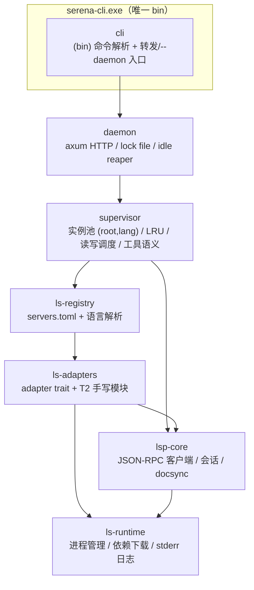
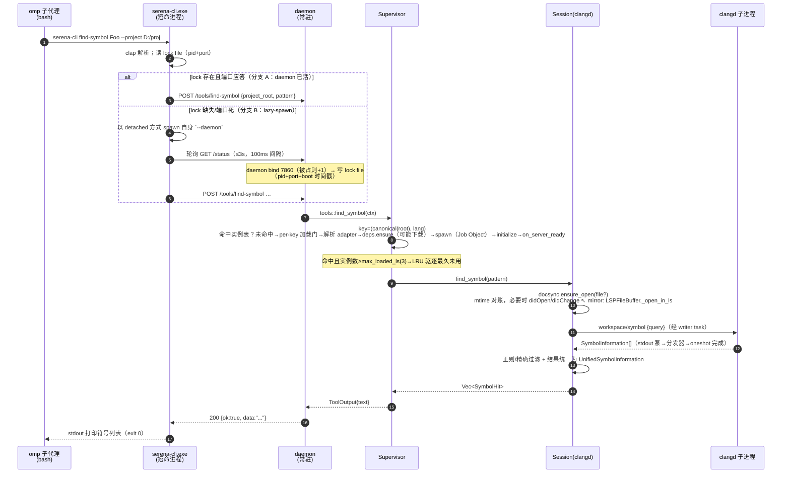
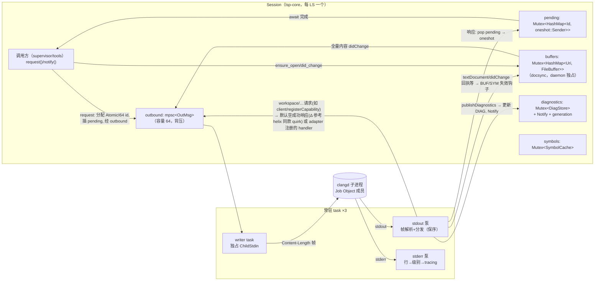
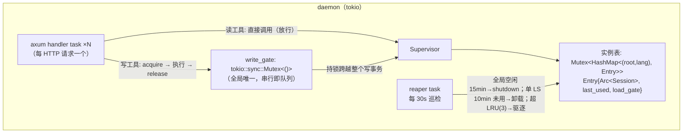
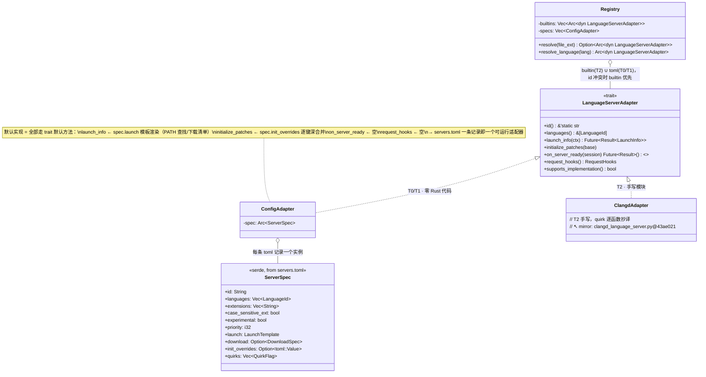
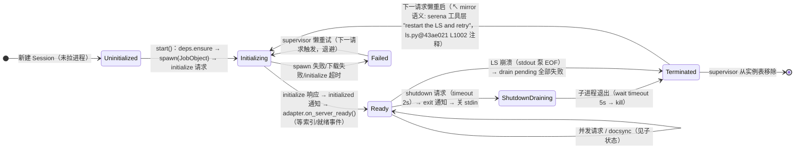
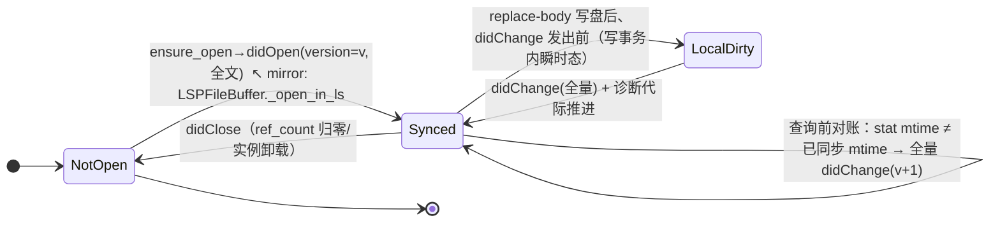
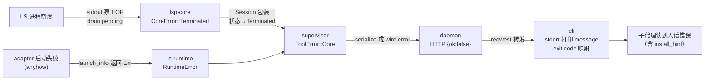

# serena-rust 架构文档（ARCHITECTURE.md v0.1）

> 输入：DESIGN.md v0.1（§3 总体架构、§4 crate 划分、§5 分档策略）。本文把 §4 细化到可开工粒度。
> 复刻基准快照：**oraios/serena@`43ae0211`**（2026-08-30，main）。所有追溯标注以此为锚。
>
> **追溯约定**：`↖ mirror: <上游文件>@43ae021 <类/方法>` 表示该设计的结构与语义抄译自上游对应物；`Δ` 前缀表示本项目相对上游的显式改动（改进或裁剪）；无标注处为本项目自有设计。参考先例：helix-lsp（Rust LSP 客户端）、async-lsp（协议底盘，未采用，见 §8）。

---

## 0. 总览：crate 依赖图



依赖方向自上而下，无环。CLI 常规路径（转发）只触及 `daemon` 的 DTO 类型与 reqwest，不拉起自建 tokio 运行时（reqwest::blocking 自带内部线程，见 §2）。

---

## 1. Workspace 布局

```
serena-rust/
├── Cargo.toml                  # [workspace]，resolver = "2"
├── DESIGN.md / ARCHITECTURE.md
├── crates/
│   ├── ls-runtime/             # 最底层：纯进程与下载，无 LSP 概念
│   │   └── src/
│   │       ├── lib.rs
│   │       ├── process.rs      # spawn / Job Object / 优雅终止   ↖ mirror: ls_process.py@43ae021 ManagedSubprocess
│   │       ├── deps.rs         # RuntimeDependency 下载器（URL+sha256+解压+PATH 回退）
│   │       │                   #   ↖ mirror: dependency_provider.py@43ae021 LanguageServerDependencyProvider*
│   │       └── logmap.rs       # stderr 行 → 日志级别映射          ↖ mirror: ls_process.py@43ae021 determine_log_level 回调
│   ├── lsp-core/               # 协议底盘：1 个 LS 进程 = 1 个 Session
│   │   └── src/
│   │       ├── lib.rs
│   │       ├── framing.rs      # Content-Length 编解码 + 消息构造 quirk   ↖ mirror: lsp_protocol_handler/server.py@43ae021 create_message/content_length/_NO_PARAMS_METHODS
│   │       ├── transport/
│   │       │   ├── mod.rs      # trait Transport + 泵拓扑（§3.2）
│   │       │   ├── stdio.rs    # 子进程 stdio 传输               ↖ mirror: ls_process.py@43ae021 StdioLanguageServer
│   │       │   └── tcp.rs      # 外部 LS TCP 连接（Godot 6008）    ↖ mirror: ls_process.py@43ae021 TCPLanguageServer
│   │       ├── client.rs       # pending 表/请求超时/ContentModified 重试/server→client 分发
│   │       │                   #   ↖ mirror: ls_process.py@43ae021 LanguageServerInterface.{send_request,_response_handler,_request_handler,_notification_handler}
│   │       ├── session.rs      # initialize 握手/能力协商/状态机（§5）  ↖ mirror: ls.py@43ae021 SolidLanguageServer.start/_create_initialize_params
│   │       ├── init_params.rs  # InitializeParams 构造器            ↖ mirror: initialize_params.py@43ae021 InitializeParamsBuilder
│   │       ├── docsync.rs      # FileBuffer 池 + 全量 didOpen/didChange  ↖ mirror: ls.py@43ae021 LSPFileBuffer + open_file_buffers
│   │       ├── diagnostics.rs  # publishDiagnostics 缓存 + 代际等待   ↖ mirror: ls.py@43ae021 _published_diagnostics_condition/_generation*
│   │       ├── symbols.rs      # 原始 documentSymbol 缓存（内容指纹）   ↖ mirror: ls.py@43ae021 _raw_document_symbols_cache*
│   │       └── types.rs        # UnifiedSymbolInformation 等内部类型   ↖ mirror: ls_types.py@43ae021
│   ├── ls-adapters/            # 适配器抽象 + T2 手写实现
│   │   └── src/
│   │       ├── lib.rs          # trait LanguageServerAdapter（§4）+ builtin_adapters() 注册表
│   │       └── clangd.rs       # M0 首个 T2，quirk 逐函数抄译        ↖ mirror: language_servers/clangd_language_server.py@43ae021
│   │       └── …rust_analyzer.rs / eclipse_jdtls.rs / …（M3 按需）
│   ├── ls-registry/            # 配置驱动层
│   │   └── src/
│   │       ├── lib.rs          # 语言→adapter 解析（扩展名/优先级/实验标记）
│   │       │                   #   ↖ mirror: ls_config.py@43ae021 LanguageServerId.get_source_fn_matcher/get_priority/is_experimental
│   │       ├── spec.rs         # ServerSpec 反序列化类型（§4.3 servers.toml schema）
│   │       └── servers.toml    # T0/T1 条目表，include_str! 内嵌进 exe；支持 %APPDATA% 外部文件覆盖
│   │                           #   ↖ mirror: ls_config.py@43ae021 LanguageServerId 枚举 + language_servers/*.py 中的模板化适配器
│   ├── supervisor/             # 编排层（DESIGN §3.1 的落地）
│   │   └── src/
│   │       ├── lib.rs          # Supervisor：实例表 + per-key 加载门 + LRU + 空闲回收
│   │       │                   #   ↖ mirror（形态）: serena project_server.py 的 per-root 加载锁；Δ 上游项目缓存只进不出，本设计加 LRU/回收
│   │       ├── write_gate.rs   # 全局写互斥（§3.3，读并行写串行的实现位置）
│   │       └── tools/          # 工具语义层：find_symbol.rs / symbol_body.rs / refs.rs / …（DESIGN §6 表）
│   │                           #   ↖ mirror（语义）: ls.py@43ae021 request_{definition,references,hover,document_symbols} + request_workspace_symbols
│   ├── daemon/                 # lib（无 main）
│   │   └── src/
│   │       ├── lib.rs          # serve()：axum router 组装
│   │       ├── http.rs         # POST /tools/{name}、GET /status、POST /shutdown + DTO（§6.3 wire 格式）
│   │       ├── lockfile.rs     # daemon 探测/lazy-spawn 协议（§2 分支 B）
│   │       └── reaper.rs       # 全局空闲自杀（默认 15min）；Δ 每 LS 实例空闲卸载在 supervisor（默认 10min）
│   └── cli/                    # 唯一 bin：serena-cli
│       └── src/main.rs         # clap 解析 → 探测 daemon → 转发/拉起；--daemon 进 daemon 模式；--direct 开发模式
└── tests/                      # 集成测试：真实拉起 clangd 的冒烟（M0 验收），逐 T0 适配器冒烟（M2）
```

**crate 职责一句话清单**

| crate | 职责 | 上游对应物 |
|---|---|---|
| `ls-runtime` | 把"一个外部命令"变成"一个可托管生命周期的子进程"，外加运行时依赖下载与 stderr 日志分级 | `ls_process.py`(进程部分) + `dependency_provider.py` |
| `lsp-core` | 与单个 LS 进程的完整 LSP 会话：JSON-RPC 传输、握手、docsync、诊断与符号缓存 | `ls.py` 核心 + `lsp_protocol_handler/` |
| `ls-adapters` | 定义 `LanguageServerAdapter` trait，承载 T2 手写 quirk 模块 | `language_servers/*.py` 大户 |
| `ls-registry` | 语言/文件 → adapter 的解析；T0/T1 服务器 = `servers.toml` 一条记录，零 Rust 代码 | `ls_config.py` + 模板化适配器 |
| `supervisor` | `(project_root, language)` 实例池、内存闸门（LRU/空闲卸载）、读并行写互斥、工具语义 | `project_server.py`（形态）+ serena 工具层（语义） |
| `daemon` | HTTP 前端、lazy-spawn 探测协议、空闲自杀 | 无（本项目新增形态） |
| `cli` | 单 exe 入口：解析、转发、拉起、渲染 | 无 |

**分层铁律**：`lsp-core` 不 import `ls-adapters`/`ls-registry`（协议层不知晓任何具体服务器）；`supervisor` 不 import axum；`daemon` 不含 LSP 语义。这是后续 MCP endpoint（DESIGN §3.2）能直接复用 supervisor 的前提。

---

## 2. 核心数据流：一次 `serena-cli find-symbol Foo`



**分支 B 竞态与残留处理**（Δ 全部为自有设计，落地于 `daemon/lockfile.rs`）：

- lock file 位置：`%LOCALAPPDATA%/serena/daemon.lock`（内容 JSON：`{pid, port, boot_ms, token}`；token 为 daemon 随机 128-bit hex，CLI 从 lock 读取后每个请求带 `X-Serena-Token` 头，daemon 校验——本机任意进程都能连 127.0.0.1，无 token 则任何本地程序可调 `replace-body` 改写文件）。
- 探测判定 = lock 存在 ∧ TCP 连通（connect 超时 500ms）；超时/拒绝即视为死 daemon（崩溃残留），删除 lock 重建。不引入进程探活 API —— lock 内 `boot_ms` + token + TCP 三检已够。
- 两个 CLI 同时冷启动：`create_new` 原子建 lock 只有一方成功（赢者 spawn daemon 并在 bind 成功后回填端口），败者轮询——正常路径不会双 daemon。唯一双实例路径：活 daemon 满载未 accept，探测窗口内被误判死 → 新 daemon bind 7860+1 并覆盖 lock，旧实例失去 lock 归属，15min 空闲自杀收敛（A6），无正确性影响。`ponytail: 竞态窗口容忍双 daemon 短暂并存，靠 idle 自杀收敛，不建分布式锁`
- `--direct` 开发模式：CLI 不经 HTTP，进程内直接构造 Supervisor 执行工具（M0 冒烟与单测路径，也覆盖 §5 状态机的直接驱动）。

**时序预算**：CLI 进程冷启动 ≤10ms（纯 clap+reqwest::blocking，无自建 tokio runtime）+ 转发 ≤10ms；daemon 冷启动 ≤100ms（目标，见 DESIGN §1）；LS 冷启动（首查触发）秒级起步 —— 壳不承诺掩盖 LS 慢，只承诺壳自身不叠加可感延迟。CLI 就绪轮询窗口 3s（超时报错可重试；LS 冷启动等待由工具请求超时 300s 覆盖，不占轮询窗口）。

---

## 3. 并发模型

### 3.1 总原则

| 状态种类 | 持有方式 | 理由 |
|---|---|---|
| 请求 pending 表、buffer 表、诊断缓存、符号缓存 | `std::sync::Mutex`（临界区内无 await） | 持锁微秒级；tokio Mutex 的 await 权衡不值得 |
| per-key 加载门、写互斥门 | `tokio::sync::Mutex`（临界区跨 await：LS 冷启动、写盘） | 需要跨 await 持锁 |
| 请求完成通知 | `tokio::sync::oneshot` | 一对一、一次性 |
| 出站消息（client→LS） | `mpsc`（有界，容量 64） | 背压：LS stdin 堵塞时向上游传 Err 而非无限积压 |
| 入站通知流（LS→client） | pump task 内联分发（不落 channel） | 保证通知**按序**处理（async-lsp README 指出的通知乱序问题） |
| 诊断代际等待 | `tokio::sync::Notify` + 代数计数 | 见 §3.4 锁清单 |
| daemon 全局状态（Supervisor 实例表） | `std::sync::Mutex<HashMap<Key, Entry>>` + 每入口 `Arc` | 查表短临界区，实体在锁外使用 |

**task 边界**：每个 LS Session 恰好 4 个常驻 tokio task（stdout 泵 / stderr 泵 / writer / 无独立分发 task——分发内联在 stdout 泵里，见下），加 daemon 全局 2 个（axum 连接处理由 axum 自管；reaper 定时 task；LRU 巡检并入 reaper）。**不采用 actor 化 Session**：Session 是带内部锁的普通结构体，quirk 钩子以 `&self` 方法直接调用，与上游 `SolidLanguageServer` 心智模型一一对应，抄译可审。

### 3.2 LS 子进程 I/O 泵：上游线程+队列 → tokio 等价

上游 `ls_process.py@43ae021` 的线程模型（已核实）：

| 上游（Python 线程/锁） | 语义 | 本设计（tokio） |
|---|---|---|
| `_read_ls_process_stdout` daemon 线程 | 逐行读头 → `Content-Length` → `read_exact` body → `_handle_body` 分发 | **stdout 泵 task**：同一帧循环；响应→查 pending 表完成 oneshot；通知/服务器请求→内联调 handler（保序） |
| `_read_ls_process_stderr` daemon 线程 + `determine_log_level` | stderr 行分级写日志 | **stderr 泵 task**：行 → logmap 分级 → `tracing` |
| `_stdin_lock` 直写（serena 现行；multilspy 原版是写线程+队列，serena 已简化为锁直写） | 串行化 stdin 写 | **writer task 独占 `ChildStdin`**：所有权即锁，免 async Mutex；从 `mpsc` 收消息。↖ 形态同 helix `transport.rs` 的 `send` task |
| `Request._result_queue: Queue[Result]` + `get_result(timeout)` | 调用方阻塞等响应 | `oneshot::Sender/Receiver` + `tokio::time::timeout` |
| `_pending_requests: dict` + `_response_handlers_lock` | id→Request 关联 | `Mutex<HashMap<Id, oneshot::Sender>>`（std 锁；Id = 归一化枚举 `Num(i64)|Str(String)`，支撑字符串 id 回退） |
| `_request_id_lock` + `request_id` 计数 | id 分配 | `AtomicI64::fetch_add` |
| `_cancel_pending_requests(exc)`（进程终止时） | 全体 pending 失败 | 泵 task 退出前 drain 表，逐个 `send(Err(Terminated))` |
| `_send_shutdown_in_thread`（shutdown 请求可能挂死，2s join） | 带超时的优雅关停 | `timeout(2s, shutdown_req)` → 发 `exit` 通知 → 关 stdin → `timeout(5s, child.wait)` → kill |
| 字符串数字响应 id 回退（`response_id.isdigit()`） | quirk：某些服务器把 id 回显成字符串 | pending 表查找时先 `i64` 后字符串归一化，两处都查 |



要点：

- **写路径无锁**：stdin 由 writer task 单一所有，天然串行。`Δ` 这是对上游 `_stdin_lock` 的等价替换（多任务并写一把锁 ↔ 单任务顺序写），语义相同、无锁竞争。
- **通知保序**：`publishDiagnostics`、`$/progress` 等在 stdout 泵内**按到达顺序内联处理**，不转发到无界 channel 再并发消费 —— 否则诊断代际可能倒序（上游 Python 同样在单读线程内串行分发）。
- **服务器→客户端请求**：未注册 handler 时默认回 `null` 成功响应而非错误（vscode-languageserver-node 系服务器把 `registerCapability` 的错误响应当致命，↖ 形态同 helix transport.rs 的 `shutdown_requested` 分支注释）。
- Windows 进程树治理：daemon 为每个 LS 子进程建 **Job Object**（`JOB_OBJECT_LIMIT_KILL_ON_JOB_CLOSE`），daemon 崩溃/被杀时 LS 全家陪葬，不留孤儿 clangd。`↖ mirror: ls_process.py@43ae021 start_independent_lsp_process=True`（语义反转：上游靠独立进程组躲 Python 崩溃连坐，本项目靠 Job Object 保证 exe 崩溃不漏进程）
- **缓存容量闸门**：`symbols`/`diagnostics` 缓存设条目上限（512 文件，超限整体清空重建——fingerprint 本就每次校验，全清是安全的，无需 LRU）。`ponytail: 定长全清；若实测命中率明显下降再换 LRU`。fingerprint 校验管新鲜度，本条管容量——长驻 daemon 数天不累积。

### 3.3 daemon 全局并发与写互斥队列（实现位置：`supervisor/src/write_gate.rs`）



- **读并行**：`find-symbol/refs/def/hover/overview` 直接并发调用 Session —— LSP 请求天然并发（DESIGN §3.1），Session 内部无全局长锁（§3.2 拓扑）。
- **in_flight 挂点与 LRU 全忙策略**：`in_flight` 由 supervisor 在工具入口/出口增减，**读工具同样计数**——reaper 卸载与 ShutdownDraining 的 `in_flight==0` 前置依赖它。LRU 驱逐遇候选全部 in-flight>0 时允许临时超 `max_loaded_ls`（新实例照起），reaper 下轮巡检再驱逐收敛。
- **写互斥**：DESIGN §3.1 的"全局互斥队列"落地为 supervisor 内**一把全局 `tokio::sync::Mutex`**。tokio Mutex 本身 FIFO 公平，等待者天然排队，不需要独立的队列数据结构。`ponytail: 全局单写门，若未来证明同文件高频并发写是热点，再按 project_root 分键`
- **写事务的持锁范围**（工具：`replace-body`；客户端只传符号名）：acquire 门 → **锁内**经 documentSymbol 解析符号 range（杜绝客户端 range 过期）→ 读盘 + content-hash 对账 → 临时文件写 + rename（`tempfile` 原子写，共享冲突重试 5×50ms，I5）→ **读回 diff 校验，不符则从写前临时副本回滚并报 `WRITE_CONFLICT`**（DESIGN C3 ③）→ `didChange` 全量同步 → 等诊断代际推进（§3.4，带 2s 超时，超时不回滚只告警）→ 失效 symbol 缓存 → release。**盘上内容与 LSP 已知内容 fingerprint 不符时拒绝执行**（§6.3）——这是两个子代理先后写同一文件的防线。
- **per-key 加载门**：`Entry.load_gate: Arc<tokio::sync::Mutex<()>>`，防止同 key 并发冷启动双拉 LS（`↖ mirror（形态）: serena project_server.py 的 per-root 加载锁`）。
- **实例键规范化**：key 的 root 经 `dunce::canonicalize`（避免 `\\?\` UNC 前缀污染 LSP 参数与 file URI），语言为 `LanguageId`。LS 实例不跨项目共享（DESIGN §3.1 第 5 条，`initialize.rootUri` 绑定）。

### 3.4 锁与同步原语清单（全项目唯一权威表）

| 原语 | 位置 | 保护对象 | 临界区 |
|---|---|---|---|
| `AtomicI64` | lsp-core `client.rs` | 请求 id 分配 | 无锁 |
| `Mutex<HashMap<Id, oneshot::Sender>>` | lsp-core `client.rs` | pending 表 | 微秒，无 await |
| `Mutex<HashMap<Uri, FileBuffer>>` | lsp-core `docsync.rs` | 打开文件表 | 微秒，无 await；didOpen/didChange 的实际发送在锁外 |
| `Mutex<DiagStore>` + `Notify` + `AtomicU64` 代数 | lsp-core `diagnostics.rs` | 诊断缓存与代际 | 微秒；等待在 Notify 上，不轮询 `↖ mirror: _published_diagnostics_condition` |
| `Mutex<SymbolCache>` | lsp-core `symbols.rs` | 文件指纹→符号缓存 | 微秒；磁盘 IO 在锁外 |
| `tokio::sync::Mutex` ×N（per-key） | supervisor `lib.rs` | LS 冷启动去重 | 跨 await（秒级） |
| `tokio::sync::Mutex<()>` ×1（全局） | supervisor `write_gate.rs` | 写事务串行化 | 跨 await（写事务全程） |
| `Mutex<HashMap<Key, Entry>>` | supervisor `lib.rs` | 实例表 | 微秒，无 await |
| `mpsc`（cap 64）×1/Session | lsp-core `transport` | client→LS 出站 | — |
| `oneshot` ×1/请求 | lsp-core `client.rs` | 响应完成 | — |

---

## 4. trait 层次与适配器体系

### 4.1 trait 定义（M0 定型；修订自 DESIGN §4 草稿）

```rust
// ls-adapters/src/lib.rs —— 签名级定义，非实现
#[async_trait::async_trait]
pub trait LanguageServerAdapter: Send + Sync {
    /// 稳定标识，如 "clangd"（对应 servers.toml 的 key 与上游 LanguageServerId 值）
    fn id(&self) -> &'static str;

    /// 本 adapter 服务哪些语言（= 实例键中的 language 维度）
    fn languages(&self) -> &'static [LanguageId];

    /// 解析启动方式：PATH 查找 / 依赖下载 / 环境变量组装。可能很慢（下载），故 async + Result
    /// ↖ mirror: dependency_provider.py@43ae021 create_launch_command(_env)
    async fn launch_info(&self, ctx: &ProjectCtx) -> anyhow::Result<LaunchInfo>;

    /// 基础 InitializeParams 补丁（capabilities 声明、初始化选项）
    /// ↖ mirror: ls.py@43ae021 _create_base_initialize_params + initialize_params.py 构造器
    fn initialize_patches(&self, base: &mut InitializeParamsBuilder) {}

    /// LS 就绪后钩子：注册 notification handler、等待服务器特有就绪事件/索引完成
    /// ↖ mirror: ls.py@43ae021 on_server_started/start 中的子类等待逻辑（如 jdtls 等服务就绪）
    async fn on_server_ready(&self, session: &Session) -> anyhow::Result<()> { Ok(()) }

    /// 请求改写钩子（quirk 用：改 params、注入额外通知）。默认无操作
    fn request_hooks(&self) -> RequestHooks { RequestHooks::default() }

    /// 该服务器是否支持 textDocument/implementation（能力探测的静态先验）
    /// ↖ mirror: ls_config.py@43ae021 supports_implementation_request
    fn supports_implementation(&self) -> bool { false }
}

pub struct LaunchInfo {           // ↖ mirror: lsp_protocol_handler/server.py@43ae021 ProcessLaunchInfo
    pub cmd: Vec<OsString>,       // 列表形式，杜绝引号拼接 quirk
    pub cwd: PathBuf,
    pub env: Vec<(String, String)>,
    pub transport: TransportKind, // Stdio | Tcp(TCPConnectionInfo)   ↖ mirror: TCPLanguageServer 的 Godot 场景
}
```

**对 DESIGN §4 草稿的修订记录**（`Δ`）：

1. `launch_info` 改 async + `Result`：依赖下载与 PATH 探测是慢 IO，同步签名会迫使调用方起 `spawn_blocking`。
2. `pre_request(&mut Session, &mut Request)` 拆为 `request_hooks() -> RequestHooks`：不再交出 `&mut Session`（Session 无外部可变性，见 §3.1 非 actor 决策），hook 是值对象，可组合、可测试。
3. 新增 `supports_implementation` 等静态能力先验，来自 ls_config.py 逐语言抄表。
4. `on_server_ready` 给默认空实现：T0 模板无需写任何 quirk 代码。

### 4.2 类图：T0 配置驱动如何生成默认实现



**T0 生成的机制**：`ConfigAdapter` 实现整个 trait，所有行为从 `ServerSpec` 字段读出 —— 这就是 DESIGN §4"零 Rust 代码"的落点。T1 与 T0 的差别只是 `download` 字段是否非空（下载走 `ls-runtime::deps`）。T2 = Rust 模块，覆盖任意方法；`Registry` 合并两来源，同 id 时 T2 优先（T2 是对同服务器配置形态的完全体）。

**语言解析**：`Registry.resolve(file_ext)` 依扩展名匹配 → 候选按 `priority` 排序（超集语言如 vue/svelte 低于 typescript，`↖ mirror: ls_config.py@43ae021 get_priority`）；`experimental` 条目仅在项目配置显式指定时生效（`↖ mirror: is_experimental + "Must be explicitly specified"` 约定）。扩展名表内嵌于 `servers.toml`（抄表自 `get_source_fn_matcher`，含 CPP 的 clang Types.cpp 全表与大小写不敏感标记）。

### 4.3 servers.toml schema（草案）

```toml
[servers.clangd]                    # T2 也保留条目：作为默认参数来源与 sync 比对基准
languages  = ["cpp"]                # LanguageId
extensions = [".c", ".h", ".cpp", ".hpp", …]   # 抄表自 get_source_fn_matcher
case_sensitive_ext = false
priority   = 2
experimental = false
supports_implementation = true

[servers.clangd.launch]             # LaunchTemplate
argv = ["clangd", "--background-index", "--limit-results=500"]
# Windows quirk 等价物照抄上游 get_binary_command_line / to_win32_args 系

[servers.crystal.launch]            # T0 样例：~150 行 Python → 一条记录
argv = ["crystallsp"]

[servers.groovysls.download]        # T1 样例
url_per_platform = { "windows-x86_64" = "…", "linux-x86_64" = "…" }
sha256_per_platform = { … }
archive = { kind = "zip", strip_components = 1, bin_path = "bin/groovy-ls.exe" }
# ↖ mirror: dependency_provider.py@43ae021 的 URL/sha256/解压约定

[servers.clangd.init_overrides]     # capabilities 覆盖，深合并进 InitializeParams
[servers.clangd.quirks]             # 已知 quirk 的开关表（如 "ue_project_detection" = true）
```

---

## 5. LSP 会话状态机



- **状态归属**：`SessionState` 存于 `Session`（`Mutex<State>`，仅 start/stop/崩溃路径写）。`Ready` 是唯一接受工具请求的状态；其余状态到来的请求按 §6 错误码返回（`LS_NOT_READY` / `LS_TERMINATED`）。
- **懒启动**：Supervisor 收到工具调用才 start（DESIGN §3.1 内存闸门 1）——状态机入口由首个请求驱动，不是注册驱动。
- **优雅关停次序**严格镜像上游 `stop()`：shutdown（2s 上限，防挂死 ↖ mirror: `_send_shutdown_in_thread` 的 join 超时）→ exit → 关 stdin → terminate(5s) → kill；随后实例表摘除、buffer 表与缓存丢弃（缓存是否落盘复用是 M4 课题，DESIGN §11.4）。

**document sync 状态归属（验收点）**：`docsync.rs` 的 buffer 表是 `Session` 的字段，**只在 daemon 侧被触达**（CLI/子代理永远走 HTTP，DESIGN §3.1"document sync 归 daemon 独占"）。每个文件的子状态：



`↖ mirror: ls.py@43ae021 LSPFileBuffer`（mtime 对账 `_read_file_modified_date(_passed_to_ls)`、`ref_count`、全量同步 —— 上游不做增量 range 同步，本项目同样只做全量，简单且规避位置映射错误）。`Δ` 新增 `LocalDirty` 显式命名写事务中的中间态，供 `WRITE_CONFLICT` 判定引用。

---

## 6. 错误处理策略

### 6.1 类型分层（thiserror 边界）

| crate | 错误类型（thiserror） | 上游对应物 |
|---|---|---|
| ls-runtime | `RuntimeError::{Spawn{cmd, cause}, Download{url, expected_sha, actual_sha}, MissingRuntime{what, install_hint}, Env{var}}` | ls_exceptions.py + dependency_provider 抛错 |
| lsp-core | `CoreError::{Framing{detail}, Io{source}, Rpc{code, message}, Timeout{method, secs}, Terminated{ls, cause}, ServerCancelled{method}}` | `↖ mirror: ls_process.py@43ae021 LSPError / LanguageServerTerminatedException / TimeoutError`；`ServerCancelled` 对应 LSP ErrorCodes.ServerCancelled |
| ls-adapters/ls-registry | `anyhow::Error`（适配器是被编排的末端，错误统一上抛） | 上游子类直接 raise |
| supervisor | `ToolError::{BadArgs{detail}, Core(CoreError), Runtime(RuntimeError), WriteConflict{path, reason}, NotInstalled{language, hint}}`（thiserror，供 wire 映射） | — |
| daemon/cli | `anyhow`（顶层装配与兜底；CLI 把 `ToolError` 渲染为 exit code） | — |

**边界规则**：库 crate（ls-runtime / lsp-core / supervisor）一律 thiserror 具名类型，**禁止 anyhow 越界进入 lsp-core**（调用方需要按变体分类重试/上报）；anyhow 只存在于 ls-adapters 内部与 daemon/cli 顶层。`ContentModified(-32801)` 不设独立变体 —— 它是 `Rpc{code:-32801}` 的判定值，重试逻辑在 `client.rs` 内部消化（opt-in 方法表 + 3 次 + 200ms，`↖ mirror: ls_process.py@43ae021 send_request + set_content_modified_retry_methods`）。

### 6.2 传播路径



### 6.3 跨 daemon 传输格式（wire contract）

```json
// POST /tools/{name} 请求体
{ "project_root": "D:/proj", "args": { "pattern": "Foo" } }

// 成功（HTTP 200）
{ "ok": true, "data": "main.rs:42  fn Foo\n…", "format": "text" }

// 失败（HTTP 200 携带业务失败，传输层错误才用 4xx/5xx）
{ "ok": false,
  "error": {
    "code": "WRITE_CONFLICT",          // 见下表枚举
    "message": "file changed on disk since last sync: src/main.rs",
    "ls": "clangd",                     // 可选：涉及的语言服务器
    "retryable": true                   // 客户端是否可直接重试
  } }
```

| `error.code` | 语义 | retryable | CLI exit |
|---|---|---|---|
| `BAD_ARGS` | 参数缺失/非法 | false | 2（usage） |
| `LS_NOT_INSTALLED` | PATH 无服务器且无下载清单 | false（提示安装） | 1 |
| `LS_SPAWN_FAILED` | 进程起不来（stderr 摘要进 message） | true | 1 |
| `LS_NOT_READY` | 初始化中，稍后再试 | true | 1 |
| `LS_TERMINATED` | 会话崩溃（supervisor 会懒重启，重试即触发） | true | 1 |
| `LS_TIMEOUT` | 请求超时（默认 300s，↖ mirror: DEFAULT_LS_REQUEST_TIMEOUT） | true | 1 |
| `RPC_ERROR` | LS 返回 JSON-RPC error | case | 1 |
| `WRITE_CONFLICT` | 盘上内容与 LSP 状态不符（§3.3 防线） | false（需重读） | 1 |
| `INTERNAL` | daemon 内部 bug（anyhow 兜底，含 chain 摘要） | false | 3 |

HTTP 层错误保留给传输语义：`404` 未知工具名、`503` daemon 关停中。**工具级失败走 200 + `{ok:false}`**，让 CLI 的分支只看 JSON，不看状态码二次判错。CLI exit：0 成功 / 1 工具失败 / 2 用法错误 / 3 daemon 或传输故障（含 daemon 拉起失败）。

---

## 7. 上游对应物总索引（追溯表）

| 本设计位置 | 上游对应物 @43ae021 | 抄译性质 |
|---|---|---|
| lsp-core `framing.rs` | `lsp_protocol_handler/server.py`（create_message/content_length/`_NO_PARAMS_METHODS`：shutdown/exit 无 params；只发 Content-Length 头，Godot 兼容；None params 补 `{}`，Delphi/FPC 兼容） | 逐 quirk 抄 |
| lsp-core `transport/stdio.rs` | `ls_process.py` `StdioLanguageServer`（帧循环、read_exact、终止时 `_cancel_pending_requests`） | 结构抄译 |
| lsp-core `transport/tcp.rs` | `ls_process.py` `TCPLanguageServer`（Godot 6008、连接重试 deadline、不发 shutdown/exit） | 结构抄译 |
| lsp-core `client.rs` | `ls_process.py` `LanguageServerInterface`（pending 表、handler 注册、ContentModified 重试、字符串 id 回退） | 结构抄译 |
| lsp-core `session.rs` | `ls.py` `SolidLanguageServer.start` + `initialize_params.py`（握手、capabilities、staleRequestSupport 声明一致性） | 结构抄译 |
| lsp-core `docsync.rs` | `ls.py` `LSPFileBuffer` + `open_file_buffers`（mtime 对账、全量同步、ref_count） | 逐行为抄 |
| lsp-core `diagnostics.rs` | `ls.py` `_published_diagnostics_*` + Condition（代际） | 语义抄译（Condition→Notify） |
| lsp-core `symbols.rs` | `ls.py` `_raw_document_symbols_cache*`（内容指纹键、cache_version） | 语义抄译（落盘 M4） |
| lsp-core `types.rs` | `ls_types.py` `UnifiedSymbolInformation` 等 | 类型抄译 |
| ls-runtime `process.rs` | `ls_process.py` `ManagedSubprocess` + `start_independent_lsp_process` | 语义反转（Job Object，§3.2） |
| ls-runtime `deps.rs` | `dependency_provider.py`（SinglePath/Uvx/BaseCommand、sha256、解压） | 结构抄译 |
| ls-runtime `logmap.rs` | 各适配器 `determine_log_level`（stderr 前缀分级） | 抄表 |
| ls-adapters `clangd.rs` | `language_servers/clangd_language_server.py`（20KB：compile_commands 转换、UE 检测、日志分级、参数表） | 逐函数抄译 + 对照其 pytest |
| ls-registry `lib.rs` | `ls_config.py`（LanguageServerId 枚举/扩展名表/priority/experimental） | 抄表进 TOML |
| ls-registry `servers.toml` | `language_servers/*.py` 中的 T0 模板（crystal 6KB 等） | 模板→配置 |
| supervisor `lib.rs` | `project_server.py` per-root 加载锁（形态）；`Δ` 加 LRU/空闲卸载（上游 `_loaded_projects_by_root` 只进不出） | 形态借鉴+改进 |
| supervisor `tools/` | `ls.py` `request_{definition,references,hover,document_symbols}` + `request_workspace_symbols` + `SymbolBody` | 语义抄译 |
| supervisor 崩溃重启 | serena 工具层 "restart the LS and retry"（ls.py@43ae021 L1002 注释） | 语义前移到 supervisor |
| writer task 单所有者 stdin | helix `helix-lsp/src/transport.rs`（send task/pending map/inject 通道/shutdown 期空响应 quirk） | Rust 先例参考 |

---

## 8. 技术选型清单

| 依赖 | 用途与理由（一行） |
|---|---|
| `tokio`（features: rt-multi-thread, process, io-util, sync, time, fs, macros） | 唯一异步运行时：I/O 泵、超时、task 治理；axum/reqwest 的公共底盘 |
| `axum` | daemon HTTP：tokio 生态默认、extractor 精简路由；备选 actix-web 被否（自建 runtime，生态分裂） |
| `reqwest`（default-features off + `blocking` + `rustls-tls`） | CLI 转发（blocking 路径免自建 runtime）与依赖下载共用一个客户端；rustls 免 OpenSSL 链接负担 |
| `clap`（derive） | CLI 解析与 `--help` 自动生成；单 exe 分发的标准答案 |
| `serde` + `serde_json` | LSP/JSON-RPC/TOML/DTO 的序列化底座 |
| `lsp-types` | LSP 3.17 官方类型（helix 同款）；适配器 seam 处一律可退化到 `serde_json::Value` 逃生舱以承接 quirk 字段 |
| `async-trait` | `LanguageServerAdapter` 需 `dyn` 分发（registry 返回 trait object），原生 async trait 尚非 object-safe |
| `thiserror` / `anyhow` | 库层具名错误 / 应用层兜底，边界见 §6.1 |
| `tracing` + `tracing-subscriber`（env-filter） | 结构化日志；stderr 泵按 logmap 分级后汇入；`RUST_LOG` 门控对齐上游 debug 行为 |
| `toml` | servers.toml 解析（含 include_str! 内嵌 + 用户目录覆盖合并） |
| `sha2` | 依赖下载 sha256 校验（↖ mirror: dependency_provider 校验约定） |
| `zip` + `flate2` | 依赖包解压（Windows 分发以 zip 为主；tar.gz 走 flate2） |
| `tempfile` | replace-body 原子写（临时文件 + rename，Windows 语义可靠） |
| `ignore`（crate） | gitignore 语义匹配（↖ mirror: pathspec GitWildMatchPattern + `ignored_paths`） |
| `regex` | find-symbol 的 pattern 过滤 |
| `win32job` | Windows Job Object：daemon 死则 LS 进程树陪葬（§3.2） |
| `dunce` | Windows canonicalize 去 `\\?\` 前缀，实例键与 LSP URI 不被 UNC 污染 |
| `windows-sys`（feature: Win32_System_Console） | CLI 启动即 `SetConsoleOutputCP(65001)`：中文 Windows 的 conhost/PowerShell/cmd 默认 GBK 码页，不设则 UTF-8 输出乱码 |
| **不引入**：`dashmap`/`parking_lot`（std Mutex 足够，§3.4 已核算临界区）、`async-lsp`（tower Service 面向服务器中间件场景；本项目的 quirk 注入点在裸传输层更贴近上游 1:1 抄译，自研泵 ~400 行，已在 §3.2 给出完整拓扑）、`tower-lsp`（方向相反：server 框架） |

---

## 9. 相对 DESIGN.md 的差异记录（ADR 式，供 v0.2 汇总）

| # | 决策 | 理由与代价 |
|---|---|---|
| A1 | DESIGN §4 的 5 crate 细化为 7（拆出 `supervisor`；daemon 拆 lib + 唯一 bin `cli`） | supervisor 承载实例池+工具语义，若埋在 daemon 则 MCP endpoint（§3.2 后期）被迫依赖 axum；拆分代价是多一个薄 crate |
| A2 | trait `launch_info` 改 async、`pre_request` 改 `request_hooks()`、默认方法全部空实现 | T0 零代码的前提是默认方法完整；代价是 hook 组合需要一个小值类型 |
| A3 | 上游"线程+每请求 Queue"映射为"3 task 泵 + oneshot"，stdin 用单 writer task 独占（无锁写） | 上游 serena 自身已放弃写线程（`_stdin_lock` 直写）；tokio 下单所有者优于跨 task 互斥锁 |
| A4 | 写互斥实现为 supervisor 一把全局 `tokio::Mutex`（无独立队列结构） | Mutex 的 FIFO 等待即 DESIGN §3.1 的"互斥队列"；分项目分键留作升级路径（已标 ponytail） |
| A5 | 工具级失败走 HTTP 200 + `{ok:false}`，传输层错误才用 4xx/5xx | CLI 判定单一入口；代价是纯 REST 工具（如 curl 探活）需读 body |
| A6 | lock file 判活 = TCP 探测（500ms 超时）+ boot 时间戳 + token，不引进程探活 API；唯一双实例路径（活 daemon 被误判死）由 idle 自杀收敛 | 最少机制覆盖崩溃残留；代价是极小概率的短暂双实例（无正确性影响） |
| A7 | 新增 `--direct` 开发模式（CLI 进程内直调 supervisor） | M0 冒烟与单测不经 HTTP；代价是 cli 多一条对 supervisor 的依赖路径（本来就有） |

**本文档不决定**（遵循任务非目标）：§11 开放问题（项目名、replace-body 里程碑归属等）维持 DESIGN.md 现状，不在此拍板。
